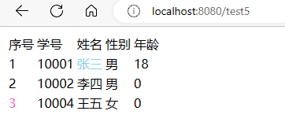

<h1 style="color:skyblue;text-align:center">FreeMarker学习笔记</h1>

[TOC]

---


# FreeMarker

## 介绍

FreeMarker是一款模板引擎： 即一种基于模板和要改变的数据， 并用来生成输出文本（HTML网页、电子邮件、配置文件、源代码等）的通用工具。 它不是面向最终用户的，而是一个Java类库，是一款程序员可以嵌入他们所开发产品的组件。
FreeMarker是免费的，基于Apache许可证2.0版本发布。其模板编写为FreeMarker Template Language（FTL），属于简单、专用的语言。需要准备数据在真实编程语言中来显示，比如数据库查询和业务运算， 之后模板显示已经准备好的数据。在模板中，主要用于如何展现数据， 而在模板之外注意于要展示什么数据


常用的java模板引擎还有哪些？

Jsp、Freemarker、Thymeleaf 、Velocity 等


## 性能特点

模板并没有包含程序逻辑来查找当前的访问者是谁，或者去查询数据库获取最新的产品。显示的数据是在FreeMarker之外准备的，通常是一些“真正的”编程语言（比如Java）所编写的代码。模板作者无需知道这些值是如何计算出的。事实上，这些值的计算方式可以完全被修改，而模板可以保持不变，而且页面的样式也可以完全被修改而无需改动模板。当模板作者（设计师）和程序员不是同一人时，显示逻辑和业务逻辑相分离的做法是非常有用的，即便模板作者和程序员是一个人，这么来做也会帮助管理应用程序的复杂性。保证模板专注于显示问题（视觉设计，布局和格式化）是高效使用模板引擎的关键


1. 通用性
能够生成各种文本：HTML、XML、RTF、Java源代码等等。
易于嵌入到产品中：轻量级；不需要Servlet环境。
插件式模板载入器：可以从任何源载入模板，如本地文件、数据库等等。
可以按所需生成文本：保存到本地文件；作为Email发送；从Web应用程序发送它返回给Web浏览器。
2. 模板语言
所有常用的指令：include、if/elseif/else、循环结构。
在模板中创建和改变变量。
几乎在任何地方都可以使用复杂表达式来指定值。
命名的宏，可以具有位置参数和嵌套内容。
名字空间有助于建立和维护可重用的宏库，或者将一个大工程分成模块，而不必担心名字冲突。
输出转换块：在嵌套模板片段生成输出时，转换HTML转义、压缩、语法高亮等等；可以定义自己的转换。
3. 通用数据模型
FreeMarker不是直接反射到Java对象，Java对象通过插件式对象封装，以变量方式在模板中显示。
可以使用抽象（接口）方式表示对象（JavaBean、XML文档、SQL查询结果集等等），告诉模板开发者使用。方法，使其不受技术细节的打扰。
xml配置
xml配置
4. 为Web准备
在模板语言中内建处理典型Web相关任务（如HTML转义）的结构。
能够集成到Model2 Web应用框架中作为JSP的替代。
支持JSP标记库。
为MVC模式设计：分离可视化设计和应用程序逻辑；分离页面设计员和程序员。
5. 智能的国际化和本地化
字符集智能化（内部使用UNICODE）。
数字格式本地化敏感。
日期和时间格式本地化敏感。
非US字符集可以用作标识（如变量名）。
多种不同语言的相同模板。
6. XML处理能力
<#recurse> 和<#visit>指令（2.3版本）用于递归遍历XML树。
在模板中清楚和直接的访问XML对象模型  。


## 快速入门

freemarker作为springmvc一种视图格式，默认情况下SpringMVC支持freemarker视图格式

需要创建Spring Boot+Freemarker工程用于测试模板。


### 创建spring boot工程

项目名称为spring_boot_freemarker_demo


### 添加依赖

```xml
    <!--freemarker 模板引擎-->
    <dependency>
        <groupId>org.springframework.boot</groupId>
        <artifactId>spring-boot-starter-freemarker</artifactId>
        <version>3.0.2</version>
    </dependency>
```


```xml
<?xml version="1.0" encoding="UTF-8"?>
<project xmlns="http://maven.apache.org/POM/4.0.0" xmlns:xsi="http://www.w3.org/2001/XMLSchema-instance"
         xsi:schemaLocation="http://maven.apache.org/POM/4.0.0 https://maven.apache.org/xsd/maven-4.0.0.xsd">
    <modelVersion>4.0.0</modelVersion>

    <parent>
        <groupId>org.springframework.boot</groupId>
        <artifactId>spring-boot-starter-parent</artifactId>
        <version>2.7.1</version>
        <relativePath/> <!-- lookup parent from repository -->
    </parent>

    <groupId>mao</groupId>
    <artifactId>spring_boot_freemarker_demo</artifactId>
    <version>0.0.1-SNAPSHOT</version>
    <name>spring_boot_freemarker_demo</name>
    <description>spring_boot_freemarker_demo</description>

    <properties>
        <java.version>1.8</java.version>
    </properties>

    <dependencies>

        <dependency>
            <groupId>org.springframework.boot</groupId>
            <artifactId>spring-boot-starter-web</artifactId>
        </dependency>

        <dependency>
            <groupId>org.springframework.boot</groupId>
            <artifactId>spring-boot-starter-test</artifactId>
            <scope>test</scope>
        </dependency>

        <!--freemarker 模板引擎-->
        <dependency>
            <groupId>org.springframework.boot</groupId>
            <artifactId>spring-boot-starter-freemarker</artifactId>
            <version>3.0.2</version>
        </dependency>

    </dependencies>

    <build>
        <plugins>
            <plugin>
                <groupId>org.springframework.boot</groupId>
                <artifactId>spring-boot-maven-plugin</artifactId>
            </plugin>
        </plugins>
    </build>

</project>
```


### 配置文件

```yaml
spring:
  freemarker:
    # 后缀名
    suffix: .ftl
    content-type: text/html
    enabled: true
    # 缓存配置
    cache: true
    # 模板加载路径 按需配置（这里就是我们上面的忽略配置）
    template-loader-path: classpath:/templates/
    # 编码格式
    charset: UTF-8
    settings:
      # 数字格式化，无小数点
      number_format: '0.##'
```


### 创建实体类

在freemarker的测试工程下创建模型类型用于测试


```java
package mao.spring_boot_freemarker_demo.entity;

/**
 * Project name(项目名称)：spring_boot_freemarker_demo
 * Package(包名): mao.spring_boot_freemarker_demo.entity
 * Class(类名): Student
 * Author(作者）: mao
 * Author QQ：1296193245
 * GitHub：https://github.com/maomao124/
 * Date(创建日期)： 2023/1/29
 * Time(创建时间)： 19:47
 * Version(版本): 1.0
 * Description(描述)： 无
 */

public class Student
{
    /**
     * id
     */
    private Long id;

    /**
     * 名字
     */
    private String name;

    /**
     * 性别
     */
    private String sex;

    /**
     * 年龄
     */
    private int age;


    /**
     * 学生
     */
    public Student()
    {
        
    }

    /**
     * 学生
     *
     * @param id   id
     * @param name 名字
     * @param sex  性别
     * @param age  年龄
     */
    public Student(Long id, String name, String sex, int age)
    {
        this.id = id;
        this.name = name;
        this.sex = sex;
        this.age = age;
    }

    /**
     * 得到id
     *
     * @return {@link Long}
     */
    public Long getId()
    {
        return id;
    }

    /**
     * 设置id
     *
     * @param id id
     */
    public void setId(Long id)
    {
        this.id = id;
    }

    /**
     * 得到名字
     *
     * @return {@link String}
     */
    public String getName()
    {
        return name;
    }

    /**
     * 设置名字
     *
     * @param name 名字
     */
    public void setName(String name)
    {
        this.name = name;
    }

    /**
     * 得到性别
     *
     * @return {@link String}
     */
    public String getSex()
    {
        return sex;
    }

    /**
     * 设置性别
     *
     * @param sex 性别
     */
    public void setSex(String sex)
    {
        this.sex = sex;
    }

    /**
     * 得到年龄
     *
     * @return int
     */
    public int getAge()
    {
        return age;
    }

    /**
     * 设置年龄
     *
     * @param age 年龄
     */
    public void setAge(int age)
    {
        this.age = age;
    }

    @Override
    @SuppressWarnings("all")
    public String toString()
    {
        final StringBuilder stringbuilder = new StringBuilder();
        stringbuilder.append("id：").append(id).append('\n');
        stringbuilder.append("name：").append(name).append('\n');
        stringbuilder.append("sex：").append(sex).append('\n');
        stringbuilder.append("age：").append(age).append('\n');
        return stringbuilder.toString();
    }
}
```


### 创建模板

在 src/main/resources下创建templates，此目录为freemarker的默认模板存放目录

在templates下创建模板文件test1.ftl，模板中的${name}最终会被freemarker替换成具体的数据


```html
<!DOCTYPE html>

<html lang="en">
<head>
    <meta charset="UTF-8">
    <title>Title</title>
</head>
<body>

<h1>hello! my name is ${name}</h1>

</body>
</html>
```


### 创建controller

创建Controller类，向Map中添加name，最后返回模板文件


```java
package mao.spring_boot_freemarker_demo;

import org.springframework.stereotype.Controller;
import org.springframework.web.bind.annotation.RequestMapping;

import javax.servlet.http.HttpServletRequest;
import java.util.Map;

/**
 * Project name(项目名称)：spring_boot_freemarker_demo
 * Package(包名): mao.spring_boot_freemarker_demo
 * Class(类名): TestController
 * Author(作者）: mao
 * Author QQ：1296193245
 * GitHub：https://github.com/maomao124/
 * Date(创建日期)： 2023/1/29
 * Time(创建时间)： 19:56
 * Version(版本): 1.0
 * Description(描述)： 无
 */

@Controller
public class TestController
{
    @RequestMapping("/test1")
    public String freemarker(Map<String, Object> map)
    {
        map.put("name", "张三");
        //返回模板文件名称
        return "test1";
    }
}
```


### 运行测试

http://localhost:8080/test1


## FreeMarker 基础指令

* 注释，即<#‐‐和‐‐>，介于其之间的内容会被freemarker忽略
* 插值（Interpolation）：即${..}部分,freemarker会用真实的值代替${..}
* FTL指令：和HTML标记类似，名字前加#予以区分，Freemarker会解析标签中的表达式或逻辑
* 文本，仅文本信息，这些不是freemarker的注释、插值、FTL指令的内容会被freemarker忽略解析，直接输出内容


### List指令

* \_index：得到循环的下标，使用方法是在stu后边加"\_index"，它的值是从0开始


#### 创建test2.ftl

```html
<!DOCTYPE html>

<html lang="en">
<head>
    <meta charset="UTF-8">
    <title>Title</title>
</head>
<body>

<table>
    <tr>
        <td>序号</td>
        <td>学号</td>
        <td>姓名</td>
        <td>性别</td>
        <td>年龄</td>
    </tr>
    <#list stus as stu>
        <tr>
            <td>${stu_index + 1}</td>
            <td>${stu.id}</td>
            <td>${stu.name}</td>
            <td>${stu.sex}</td>
            <td>${stu.age}</td>
        </tr>
    </#list>
</table>

</body>
</html>
```


#### 修改controller

```java
package mao.spring_boot_freemarker_demo;

import mao.spring_boot_freemarker_demo.entity.Student;
import org.springframework.stereotype.Controller;
import org.springframework.web.bind.annotation.RequestMapping;

import javax.servlet.http.HttpServletRequest;
import java.util.ArrayList;
import java.util.List;
import java.util.Map;

/**
 * Project name(项目名称)：spring_boot_freemarker_demo
 * Package(包名): mao.spring_boot_freemarker_demo
 * Class(类名): TestController
 * Author(作者）: mao
 * Author QQ：1296193245
 * GitHub：https://github.com/maomao124/
 * Date(创建日期)： 2023/1/29
 * Time(创建时间)： 19:56
 * Version(版本): 1.0
 * Description(描述)： 无
 */

@Controller
public class TestController
{
    @RequestMapping("/test1")
    public String freemarker(Map<String, Object> map)
    {
        map.put("name", "张三");
        //返回模板文件名称
        return "test1";
    }

    @RequestMapping("/test2")
    public String freemarker2(Map<String, Object> map)
    {
        Student student1 = new Student();
        student1.setId(10001L);
        student1.setName("张三");
        student1.setSex("男");
        student1.setAge(18);

        Student student2 = new Student();
        student2.setId(10002L);
        student2.setName("李四");
        student2.setSex("男");
        student2.setAge(19);

        Student student3 = new Student();
        student3.setId(10004L);
        student3.setName("王五");
        student3.setSex("女");
        student3.setAge(17);

        List<Student> list = new ArrayList<>(3);
        list.add(student1);
        list.add(student2);
        list.add(student3);

        map.put("stus", list);

        //返回模板文件名称
        return "test2";
    }
}
```


#### 运行测试

http://localhost:8080/test2


### 遍历Map数据

#### 创建test3.ftl

```html
<!DOCTYPE html>

<html lang="en">
<head>
    <meta charset="UTF-8">
    <title>Title</title>
</head>
<body>

<table>
    <tr>
        <td>序号</td>
        <td>学号</td>
        <td>姓名</td>
        <td>性别</td>
        <td>年龄</td>
    </tr>
    <#list studentMap?keys as k>
        <tr>
            <td>${k_index + 1}</td>
            <td>${studentMap[k].id}</td>
            <td>${studentMap[k].name}</td>
            <td>${studentMap[k].sex}</td>
            <td>${studentMap[k].age}</td>
        </tr>
    </#list>
</table>

<br>

${studentMap['student1'].name}
<br>
${studentMap.student2.name}

</body>
</html>
```


#### 修改controller

```java
package mao.spring_boot_freemarker_demo;

import mao.spring_boot_freemarker_demo.entity.Student;
import org.springframework.stereotype.Controller;
import org.springframework.web.bind.annotation.RequestMapping;

import javax.servlet.http.HttpServletRequest;
import java.util.ArrayList;
import java.util.HashMap;
import java.util.List;
import java.util.Map;

/**
 * Project name(项目名称)：spring_boot_freemarker_demo
 * Package(包名): mao.spring_boot_freemarker_demo
 * Class(类名): TestController
 * Author(作者）: mao
 * Author QQ：1296193245
 * GitHub：https://github.com/maomao124/
 * Date(创建日期)： 2023/1/29
 * Time(创建时间)： 19:56
 * Version(版本): 1.0
 * Description(描述)： 无
 */

@Controller
public class TestController
{
    @RequestMapping("/test1")
    public String freemarker(Map<String, Object> map)
    {
        map.put("name", "张三");
        //返回模板文件名称
        return "test1";
    }

    @RequestMapping("/test2")
    public String freemarker2(Map<String, Object> map)
    {
        Student student1 = new Student();
        student1.setId(10001L);
        student1.setName("张三");
        student1.setSex("男");
        student1.setAge(18);

        Student student2 = new Student();
        student2.setId(10002L);
        student2.setName("李四");
        student2.setSex("男");
        student2.setAge(19);

        Student student3 = new Student();
        student3.setId(10004L);
        student3.setName("王五");
        student3.setSex("女");
        student3.setAge(17);

        List<Student> list = new ArrayList<>(3);
        list.add(student1);
        list.add(student2);
        list.add(student3);

        map.put("stus", list);

        //返回模板文件名称
        return "test2";
    }

    @RequestMapping("/test3")
    public String freemarker3(Map<String, Object> map)
    {
        Student student1 = new Student();
        student1.setId(10001L);
        student1.setName("张三");
        student1.setSex("男");
        student1.setAge(18);

        Student student2 = new Student();
        student2.setId(10002L);
        student2.setName("李四");
        student2.setSex("男");
        student2.setAge(19);

        Student student3 = new Student();
        student3.setId(10004L);
        student3.setName("王五");
        student3.setSex("女");
        student3.setAge(17);

        Map<String, Student> studentMap = new HashMap<>();

        studentMap.put("student1", student1);
        studentMap.put("student2", student2);
        studentMap.put("student3", student3);

        map.put("studentMap", studentMap);

        //返回模板文件名称
        return "test3";
    }
}
```


#### 运行测试

http://localhost:8080/test3


### if指令

if 指令即判断指令，是常用的FTL指令，freemarker在解析时遇到if会进行判断，条件为真则输出if中间的内容，否则跳过内容不再输出


#### 创建test4.ftl

```html
<!DOCTYPE html>

<html lang="en">
<head>
    <meta charset="UTF-8">
    <title>Title</title>
</head>
<body>

<table>
    <tr>
        <td>序号</td>
        <td>学号</td>
        <td>姓名</td>
        <td>性别</td>
        <td>年龄</td>
    </tr>
    <#list stus as stu>
        <tr>
            <td <#if stu_index==2>style="color: hotpink" </#if>>${stu_index + 1}</td>
            <td>${stu.id}</td>
            <td<#if stu.name=='张三'> style="color: skyblue" </#if>>${stu.name}</td>
            <td>${stu.sex}</td>
            <td>${stu.age}</td>
        </tr>
    </#list>
</table>

</body>
</html>
```


#### 修改controller

```java
package mao.spring_boot_freemarker_demo;

import mao.spring_boot_freemarker_demo.entity.Student;
import org.springframework.stereotype.Controller;
import org.springframework.web.bind.annotation.RequestMapping;

import javax.servlet.http.HttpServletRequest;
import java.util.ArrayList;
import java.util.HashMap;
import java.util.List;
import java.util.Map;

/**
 * Project name(项目名称)：spring_boot_freemarker_demo
 * Package(包名): mao.spring_boot_freemarker_demo
 * Class(类名): TestController
 * Author(作者）: mao
 * Author QQ：1296193245
 * GitHub：https://github.com/maomao124/
 * Date(创建日期)： 2023/1/29
 * Time(创建时间)： 19:56
 * Version(版本): 1.0
 * Description(描述)： 无
 */

@Controller
public class TestController
{
    @RequestMapping("/test1")
    public String freemarker(Map<String, Object> map)
    {
        map.put("name", "张三");
        //返回模板文件名称
        return "test1";
    }

    @RequestMapping("/test2")
    public String freemarker2(Map<String, Object> map)
    {
        Student student1 = new Student();
        student1.setId(10001L);
        student1.setName("张三");
        student1.setSex("男");
        student1.setAge(18);

        Student student2 = new Student();
        student2.setId(10002L);
        student2.setName("李四");
        student2.setSex("男");
        student2.setAge(19);

        Student student3 = new Student();
        student3.setId(10004L);
        student3.setName("王五");
        student3.setSex("女");
        student3.setAge(17);

        List<Student> list = new ArrayList<>(3);
        list.add(student1);
        list.add(student2);
        list.add(student3);

        map.put("stus", list);

        //返回模板文件名称
        return "test2";
    }

    @RequestMapping("/test3")
    public String freemarker3(Map<String, Object> map)
    {
        Student student1 = new Student();
        student1.setId(10001L);
        student1.setName("张三");
        student1.setSex("男");
        student1.setAge(18);

        Student student2 = new Student();
        student2.setId(10002L);
        student2.setName("李四");
        student2.setSex("男");
        student2.setAge(19);

        Student student3 = new Student();
        student3.setId(10004L);
        student3.setName("王五");
        student3.setSex("女");
        student3.setAge(17);

        Map<String, Student> studentMap = new HashMap<>();

        studentMap.put("student1", student1);
        studentMap.put("student2", student2);
        studentMap.put("student3", student3);

        map.put("studentMap", studentMap);

        //返回模板文件名称
        return "test3";
    }

    @RequestMapping("/test4")
    public String freemarker4(Map<String, Object> map)
    {
        Student student1 = new Student();
        student1.setId(10001L);
        student1.setName("张三");
        student1.setSex("男");
        student1.setAge(18);

        Student student2 = new Student();
        student2.setId(10002L);
        student2.setName("李四");
        student2.setSex("男");
        student2.setAge(19);

        Student student3 = new Student();
        student3.setId(10004L);
        student3.setName("王五");
        student3.setSex("女");
        student3.setAge(17);

        List<Student> list = new ArrayList<>(3);
        list.add(student1);
        list.add(student2);
        list.add(student3);

        map.put("stus", list);

        //返回模板文件名称
        return "test4";
    }
}
```


#### 运行测试

http://localhost:8080/test4


### 运算符

* 算数运算符 FreeMarker表达式中完全支持算术运算,FreeMarker支持的算术运算符包括:+, - , * , / , %
* 逻辑运算符 逻辑运算符有如下几个: 逻辑与:&& 逻辑或:|| 逻辑非:! 逻辑运算符只能作用于布尔值,否则将产生错误
* 比较运算符 表达式中支持的比较运算符有如下几个：
  * =或者==:判断两个值是否相等
  * !=:判断两个值是否不等
  * \> 或者gt:判断左边值是否大于右边值
  * \>=或者gte:判断左边值是否大于等于右边值
  * <或者lt:判断左边值是否小于右 边值
  * <=或者lte:判断左边值是否小于等于右边值


注意: =和!=可以用于字符串,数值和日期来比较是否相等,但=和!=两边必须是相同类型的值,否则会产生错误,而且 FreeMarker是精确比较,"x","x ","X"是不等的.其它的运行符可以作用于数字和日期,但不能作用于字符串,大部分的时 候,使用gt等字母运算符代替>会有更好的效果,因为 FreeMarker会把>解释成FTL标签的结束字符,当然,也可以使用括 号来避免这种情况,如:<#if (x>y)>


### 空值处理

判断某变量是否存在使用 “??” 用法为:variable??,如果该变量存在,返回true,否则返回false

缺失变量默认值使用 “!” 使用!要以指定一个默认值，当变量为空时显示默认值

如果是嵌套对象则建议使用（）括起来


为防止stus为空报错可以加上if判断


#### 创建test5.ftl

```html
<!DOCTYPE html>

<html lang="en">
<head>
    <meta charset="UTF-8">
    <title>Title</title>
</head>
<body>

<#if stus??>

    <table>
        <tr>
            <td>序号</td>
            <td>学号</td>
            <td>姓名</td>
            <td>性别</td>
            <td>年龄</td>
        </tr>
        <#list stus as stu>
            <tr>
                <td <#if stu_index==2>style="color: hotpink" </#if>>${stu_index + 1}</td>
                <td>${stu.id}</td>
                <td<#if stu.name=='张三'> style="color: skyblue" </#if>>${stu.name}</td>
                <td>${stu.sex}</td>
                <td>${(stu.age)!}</td>
            </tr>
        </#list>
    </table>

</#if>

<#if !stus??>
    变量 stus 为null
</#if>

</body>
</html>

```


#### 修改controller

```java
package mao.spring_boot_freemarker_demo;

import mao.spring_boot_freemarker_demo.entity.Student;
import org.springframework.stereotype.Controller;
import org.springframework.web.bind.annotation.RequestMapping;

import javax.servlet.http.HttpServletRequest;
import java.util.ArrayList;
import java.util.HashMap;
import java.util.List;
import java.util.Map;

/**
 * Project name(项目名称)：spring_boot_freemarker_demo
 * Package(包名): mao.spring_boot_freemarker_demo
 * Class(类名): TestController
 * Author(作者）: mao
 * Author QQ：1296193245
 * GitHub：https://github.com/maomao124/
 * Date(创建日期)： 2023/1/29
 * Time(创建时间)： 19:56
 * Version(版本): 1.0
 * Description(描述)： 无
 */

@Controller
public class TestController
{
    @RequestMapping("/test1")
    public String freemarker(Map<String, Object> map)
    {
        map.put("name", "张三");
        //返回模板文件名称
        return "test1";
    }

    @RequestMapping("/test2")
    public String freemarker2(Map<String, Object> map)
    {
        Student student1 = new Student();
        student1.setId(10001L);
        student1.setName("张三");
        student1.setSex("男");
        student1.setAge(18);

        Student student2 = new Student();
        student2.setId(10002L);
        student2.setName("李四");
        student2.setSex("男");
        student2.setAge(19);

        Student student3 = new Student();
        student3.setId(10004L);
        student3.setName("王五");
        student3.setSex("女");
        student3.setAge(17);

        List<Student> list = new ArrayList<>(3);
        list.add(student1);
        list.add(student2);
        list.add(student3);

        map.put("stus", list);

        //返回模板文件名称
        return "test2";
    }

    @RequestMapping("/test3")
    public String freemarker3(Map<String, Object> map)
    {
        Student student1 = new Student();
        student1.setId(10001L);
        student1.setName("张三");
        student1.setSex("男");
        student1.setAge(18);

        Student student2 = new Student();
        student2.setId(10002L);
        student2.setName("李四");
        student2.setSex("男");
        student2.setAge(19);

        Student student3 = new Student();
        student3.setId(10004L);
        student3.setName("王五");
        student3.setSex("女");
        student3.setAge(17);

        Map<String, Student> studentMap = new HashMap<>();

        studentMap.put("student1", student1);
        studentMap.put("student2", student2);
        studentMap.put("student3", student3);

        map.put("studentMap", studentMap);

        //返回模板文件名称
        return "test3";
    }

    @RequestMapping("/test4")
    public String freemarker4(Map<String, Object> map)
    {
        Student student1 = new Student();
        student1.setId(10001L);
        student1.setName("张三");
        student1.setSex("男");
        student1.setAge(18);

        Student student2 = new Student();
        student2.setId(10002L);
        student2.setName("李四");
        student2.setSex("男");
        student2.setAge(19);

        Student student3 = new Student();
        student3.setId(10004L);
        student3.setName("王五");
        student3.setSex("女");
        student3.setAge(17);

        List<Student> list = new ArrayList<>(3);
        list.add(student1);
        list.add(student2);
        list.add(student3);

        map.put("stus", list);

        //返回模板文件名称
        return "test4";
    }

    @RequestMapping("/test5")
    public String freemarker5(Map<String, Object> map)
    {
        Student student1 = new Student();
        student1.setId(10001L);
        student1.setName("张三");
        student1.setSex("男");
        student1.setAge(18);

        Student student2 = new Student();
        student2.setId(10002L);
        student2.setName("李四");
        student2.setSex("男");
        //一定概率为空
        if (Math.random() > 0.5)
        {
            student2.setAge(19);
        }
        Student student3 = new Student();
        student3.setId(10004L);
        student3.setName("王五");
        student3.setSex("女");
        //一定概率为空
        if (Math.random() > 0.5)
        {
            student3.setAge(17);
        }


        List<Student> list = new ArrayList<>(3);
        list.add(student1);
        list.add(student2);
        list.add(student3);

        //一定概率为空
        if (Math.random() > 0.5)
        {
            map.put("stus", list);
        }

        //返回模板文件名称
        return "test5";
    }
}
```


#### 运行测试

http://localhost:8080/test5


多刷新几次查看结果





### 内置对象

在freemarker中可以访问Request、Session等内置对象

* Request： 用于获取Request对象中的attribute对象
* Session：用于获取Session对象中的attribute对象
* RequestParameters：用于获取Request对象的parameter参数（浏览器端发送的请求数据）


#### 配置

```yaml
spring:
  freemarker:
  #把Spring的RequestContext对象暴露为变量rc
  request‐context‐attribute: rc 
  # request
  expose‐request‐attributes: true
  # session
  expose‐session‐attributes: true
```


全部配置

```yaml
spring:
  freemarker:
    # 后缀名
    suffix: .ftl
    content-type: text/html
    enabled: true
    # 缓存配置
    cache: true
    # 模板加载路径 按需配置（这里就是我们上面的忽略配置）
    template-loader-path: classpath:/templates/
    # 编码格式
    charset: UTF-8
    #把Spring的RequestContext对象暴露为变量rc
    request‐context‐attribute: rc
    # request
    expose‐request‐attributes: true
    # session
    expose‐session‐attributes: true
    settings:
      # 数字格式化，无小数点
      number_format: '0.##'
```


#### 创建test6.ftl

```html
<!DOCTYPE html>

<html lang="en">
<head>
    <meta charset="UTF-8">
    <title>Title</title>
</head>
<body>

<br>

请求参数key：${RequestParameters['key']!""}
<br>
request的request1：${Request['request1'!""]}
<br>
request的request2：${Request['request2'!""]}
<br>
session的session1：${Request['session1'!""]}
<br>
session的session2：${Request['session2'!""]}
<br>
工程路径：${rc.contextPath}
<br>
请求地址: ${rc.requestUri}
<br>

</body>
</html>
```


#### 修改controller

```java
package mao.spring_boot_freemarker_demo;

import mao.spring_boot_freemarker_demo.entity.Student;
import org.springframework.stereotype.Controller;
import org.springframework.web.bind.annotation.RequestMapping;

import javax.servlet.http.HttpServletRequest;
import javax.servlet.http.HttpSession;
import java.util.ArrayList;
import java.util.HashMap;
import java.util.List;
import java.util.Map;

/**
 * Project name(项目名称)：spring_boot_freemarker_demo
 * Package(包名): mao.spring_boot_freemarker_demo
 * Class(类名): TestController
 * Author(作者）: mao
 * Author QQ：1296193245
 * GitHub：https://github.com/maomao124/
 * Date(创建日期)： 2023/1/29
 * Time(创建时间)： 19:56
 * Version(版本): 1.0
 * Description(描述)： 无
 */

@Controller
public class TestController
{
    @RequestMapping("/test1")
    public String freemarker(Map<String, Object> map)
    {
        map.put("name", "张三");
        //返回模板文件名称
        return "test1";
    }

    @RequestMapping("/test2")
    public String freemarker2(Map<String, Object> map)
    {
        Student student1 = new Student();
        student1.setId(10001L);
        student1.setName("张三");
        student1.setSex("男");
        student1.setAge(18);

        Student student2 = new Student();
        student2.setId(10002L);
        student2.setName("李四");
        student2.setSex("男");
        student2.setAge(19);

        Student student3 = new Student();
        student3.setId(10004L);
        student3.setName("王五");
        student3.setSex("女");
        student3.setAge(17);

        List<Student> list = new ArrayList<>(3);
        list.add(student1);
        list.add(student2);
        list.add(student3);

        map.put("stus", list);

        //返回模板文件名称
        return "test2";
    }

    @RequestMapping("/test3")
    public String freemarker3(Map<String, Object> map)
    {
        Student student1 = new Student();
        student1.setId(10001L);
        student1.setName("张三");
        student1.setSex("男");
        student1.setAge(18);

        Student student2 = new Student();
        student2.setId(10002L);
        student2.setName("李四");
        student2.setSex("男");
        student2.setAge(19);

        Student student3 = new Student();
        student3.setId(10004L);
        student3.setName("王五");
        student3.setSex("女");
        student3.setAge(17);

        Map<String, Student> studentMap = new HashMap<>();

        studentMap.put("student1", student1);
        studentMap.put("student2", student2);
        studentMap.put("student3", student3);

        map.put("studentMap", studentMap);

        //返回模板文件名称
        return "test3";
    }

    @RequestMapping("/test4")
    public String freemarker4(Map<String, Object> map)
    {
        Student student1 = new Student();
        student1.setId(10001L);
        student1.setName("张三");
        student1.setSex("男");
        student1.setAge(18);

        Student student2 = new Student();
        student2.setId(10002L);
        student2.setName("李四");
        student2.setSex("男");
        student2.setAge(19);

        Student student3 = new Student();
        student3.setId(10004L);
        student3.setName("王五");
        student3.setSex("女");
        student3.setAge(17);

        List<Student> list = new ArrayList<>(3);
        list.add(student1);
        list.add(student2);
        list.add(student3);

        map.put("stus", list);

        //返回模板文件名称
        return "test4";
    }

    @RequestMapping("/test5")
    public String freemarker5(Map<String, Object> map)
    {
        Student student1 = new Student();
        student1.setId(10001L);
        student1.setName("张三");
        student1.setSex("男");
        student1.setAge(18);

        Student student2 = new Student();
        student2.setId(10002L);
        student2.setName("李四");
        student2.setSex("男");
        //一定概率为空
        if (Math.random() > 0.5)
        {
            student2.setAge(19);
        }
        Student student3 = new Student();
        student3.setId(10004L);
        student3.setName("王五");
        student3.setSex("女");
        //一定概率为空
        if (Math.random() > 0.5)
        {
            student3.setAge(17);
        }


        List<Student> list = new ArrayList<>(3);
        list.add(student1);
        list.add(student2);
        list.add(student3);

        //一定概率为空
        if (Math.random() > 0.5)
        {
            map.put("stus", list);
        }

        //返回模板文件名称
        return "test5";
    }


    @RequestMapping("/test6")
    public String freemarker6(Map<String, Object> map, HttpServletRequest httpServletRequest, HttpSession session)
    {
        //设置
        httpServletRequest.setAttribute("request1","1234");
        httpServletRequest.setAttribute("request2","5678");

        session.setAttribute("session1","1111111");
        session.setAttribute("session2","2222222");


        //返回模板文件名称
        return "test6";
    }
}
```


#### 运行测试


http://localhost:8080/test6?key=123


---
end

---
by  mao
2023  01  29

---